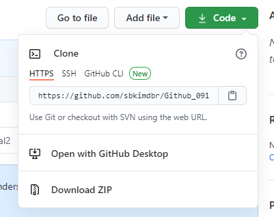

### 0918 Github 수업내용

### 원격저장소 활용하기

#### 충돌상황

- 원격저장소의 이력과 로컬 저장소의 이력이 다르다.

```bash

```


- 해결방법

```bash
$ git pull origin master		
```

1.

2.

#### origin master 다시 설정하기


#### ide.cs50.io 활용하기

강의장에서 다운로드 -> 저장소에서 clone




1. repository url 복사하기
2. cs50 ide 에 작성하기

 ```bash
$ git clone url
ex)$ git clone https://github.com/sbkimdbr/Github_0918.git
 ```


